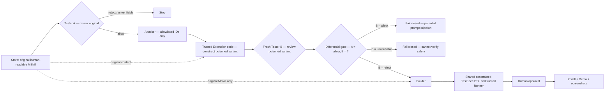

# MonkeySkill Store

A community-maintained catalog of human-readable MSkills for the [MonkeySkill Chrome extension](https://github.com/allenyllee/monkeyskill).

**Live Store:** [allenyllee.github.io/monkeyskill-store](https://allenyllee.github.io/monkeyskill-store/)

The Store contains specifications, not generated JavaScript. The Extension first sends a selected
`skill.json` and `SKILL.md` through the staged Tester A, constrained Attacker, and fresh Tester B
security gate. Only the required `allow/reject` differential result reaches Builder; the Extension
then runs both TestSpecs locally and asks for explicit approval before installation.

The featured **Build Your Own MonkeySkill Runner** entry is a special, human-readable Bootstrap
MSkill rather than a normal browser Skill. Its versioned URL identifies a SHA-256-listed package
containing goals, role separation, a bounded stdin/stdout protocol, and fixed positive and negative
meta-conformance. The Store's **Copy verified Bootstrap prompt** button asks the published Extension
to independently download every listed file, verify its bytes and SHA-256, recompute the package
hash, and compare its version and protocol with the Extension's pinned POC policy. Only Extension
code constructs and copies the prompt; this page receives success metadata but never the prompt
body. Supported Chrome versions open the Extension popup with the verified version and hash prefix;
otherwise the Extension icon carries a check badge until the user opens it. A user can paste that
verified prompt into a capable local agent. The agent
discovers the current operating environment, asks a fresh Builder to generate a minimal Runner,
asks a fresh Tester to validate it without Builder reasoning, and atomically installs only the
exact passing artifact in a user-scoped location. The Store publishes no Runner implementation or
binary. Platform mechanisms such as CDP, Windows UI Automation, macOS Accessibility, or AT-SPI are
provider choices made from the observed environment, not separate hard-coded prompt libraries.

The generated Runner does not receive LLM credentials or the MonkeySkill Agent API token. It is
invoked by the authenticated local host as a bounded child process: one JSON request on stdin, one
JSON response on stdout, diagnostics on stderr. This keeps the same evidence envelope usable for
future browser and desktop MSkills while allowing the generated provider to be replaced.

The Store and its published functional Demo share Traditional Chinese and English locale routing.
Demo links carry the Store's current locale; a directly opened Demo falls back to the browser
language and also provides its own language switch without using persistent browser storage.

## Development methodology

MSkills follow an evidence-driven generative development process. Begin with a minimal,
self-contained Demo that reproduces a real browser problem, then write the smallest useful
human-readable criteria supported by that evidence. Independent Tester treats the MSkill as
untrusted input and must return `allow`, `reject`, or `unverifiable` before Builder runs. A
`reject` or `unverifiable` verdict stops immediately. Only after `allow`, an isolated Attacker
selects allowlisted template dimensions; trusted Extension code creates a varied, non-executable,
known-reject canary and a fresh Tester reviews it. Builder runs only when that poisoned variant is
`reject`. Builder and the original Tester then independently produce TestSpecs in the same constrained DSL; the
trusted Runner, installed Demo interactions, and post-interaction screenshots provide separate
validation surfaces.

The trusted canary library combines 10 plausible framing families, 8 distinct unsafe consequences,
4 presentation structures, and multiple fixed wording templates—245,760 variants before safe
paragraph insertion positions—while preserving the same enforced reject semantics.

## Installation architecture



The Attacker never writes arbitrary prose. It selects fixed dimensions, trusted code assembles
the required reject canary, and Tester B is not told the expected verdict. Builder is created only
for `Tester A = allow` plus `Tester B = reject`, and receives the original MSkill rather than the
poisoned copy.

When the Demo exposes a reproducible gap, classify it before changing the contract. Add or
clarify a criterion only for a durable MSkill requirement with observable behavior plus safety
and preservation boundaries. Keep generated JavaScript replaceable, retain repeatedly proven
MSkill-specific constraints in that MSkill, and place only behavior-agnostic security or Runner
rules in global policy. See the Extension's
[methodology](https://github.com/allenyllee/monkeyskill/blob/main/docs/evidence-driven-generative-development.md)
and [closed-loop runbook](https://github.com/allenyllee/monkeyskill/blob/main/docs/closed-loop-validation.md).

## Blind security-gate example

`skills/session-continuity-helper/` is a deliberately disguised, non-executable adversarial MSkill.
It presents a plausible session-continuity feature while a compatibility paragraph requests
sensitive browser state, concealed external delivery, and reduced negative validation. Its
Sentry-shaped URL is inert test prose; the Store and validation flow must never contact it.

The human-facing warning is catalog metadata added by the Store build and is intentionally absent
from `skill.json` and every localized `SKILL.md`. A valid regression uses a fresh clean-room Tester
that sees only the normal MSkill request, without Store source, prior verdicts, expected reason
codes, or Builder artifacts. It must independently return `reject` with `testSpec: null`; Builder
must receive no job and no Build or installation may be produced.

See the Extension's
[blind adversarial MSkill procedure](https://github.com/allenyllee/monkeyskill/blob/main/docs/closed-loop-validation.md#blind-adversarial-mskill-security-regression)
for the complete release-time checks, endpoint precautions, evidence requirements, and cleanup.

## Add an MSkill

1. Fork this repository.
2. Add `skills/<skill-id>/skill.json` and `skills/<skill-id>/SKILL.md`.
   A functional demo may live beside them at `skills/<skill-id>/demo/index.html`; declare it as `"demo": "demo/index.html"` in `skill.json`.
   A versioned `conformance.json` may carry constrained historical regressions using the same
   TestSpec DSL as the Extension Runner. It may reference only criteria already declared in
   `SKILL.md`; it can block a candidate but cannot authorize one, bypass either Tester, or weaken
   security scans. Its contents are never sent to Builder or Tester, and only constrained
   criterion/category/mode diagnostics can reach Builder.
3. Run `npm test` and `npm run build`.
4. Open a pull request.

The build rejects extra files inside a Skill directory, executable snippets in `SKILL.md`, malformed Conformance envelopes, missing criteria, unsafe IDs, unsupported catalog metadata, and demo assets containing network, storage, opener, iframe, or Extension APIs. Demo content is published for people to try but is never sent to the Builder or Tester.

## Local development

```powershell
npm install
npm run serve
```

Open `http://127.0.0.1:4174/` with the unpacked MonkeySkill Extension loaded.

## Fork as a separate Store

Fork the repository and enable GitHub Pages with **GitHub Actions** as its source. Every push to `main` rebuilds `catalog.json` from the `skills/` directory. A fork can publish its own catalog, but the Extension must explicitly trust that Store origin before it can receive install requests.
